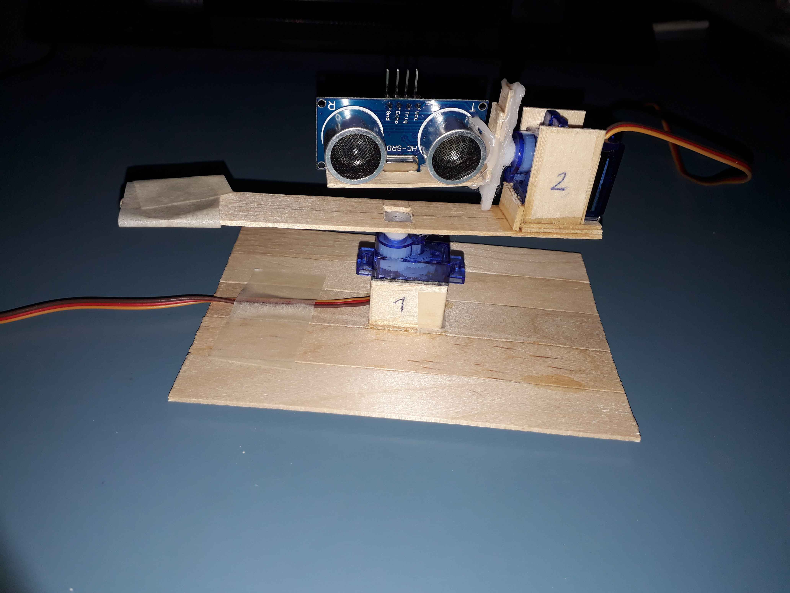
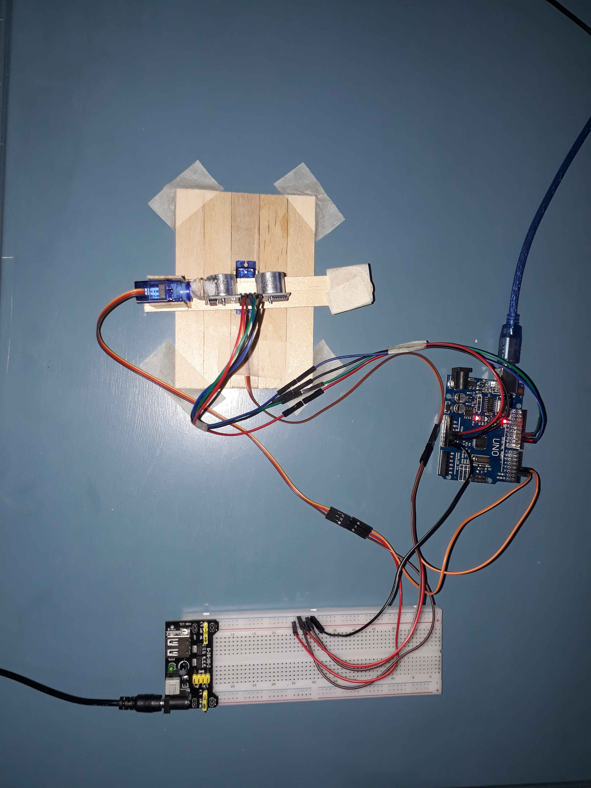

# Ultrasonic Sensor Point Cloud | Arduino
Visualizing the environment with an ultrasonic sensor by gathering points that form a 3D point cloud using Arduino.

https://gwenyth06.github.io/Ultrasonic-Sensor-Point-Cloud-Arduino/3d_plot.html
https://gwenyth06.github.io/Ultrasonic-Sensor-Point-Cloud-Arduino/3d_plot2.html

# Components
* 1x HC-SR04 Ultrasonic Sensor
* 2x 9g Servos
* 1x 3.3V / 5V Output Breadboard Power Module (e.g., mb102)
* 1x 9V / 1 Amp Adaptor
* 1x Breadboard (sufficient space for mb102)

# Tools and Materials
* Male/Female Jumper Wires
* Craft Sticks (or any suitable material)
* Glue Gun (or any adhesive safe for electronics)

# Software
* Arduino IDE
* Visual Studio Code (or any preferred IDE)

# Description
This project aims to visualize real-time data from an ultrasonic sensor mounted on servo motors using 3D point cloud visualization. The ultrasonic sensor scans its environment by rotating on two axes, capturing distance measurements at various angles. These measurements are then converted into Cartesian coordinates and visualized as a dynamic 3D point cloud, providing an intuitive representation of the surrounding objects' spatial distribution and distances.

# Circuit Diagram
* Servos powered by an external breadboard power supply
* Ultrasonic sensor powered by Arduino UNO
  
The servos should not be powered by the Arduino directly due to insufficient current supply, which could damage the voltage regulator. Instead, an external power supply is used. The HC-SR04 ultrasonic module consumes 15 mA and operates at 5V, so it is connected directly to the Arduino.

# Assembling the Components
To scan the environment in 3D, two servos are required:

* Servo 1 for horizontal movement
* Servo 2 for vertical movement
* 
Servo 1 is placed at the bottom to rotate horizontally, while Servo 2 is mounted on top to turn the sensor vertically.

After assembling the components and wiring the jumpers, connect the setup to power. Ensure to ground the servos properly to prevent erratic behavior.

# How It Works
The project involves an Arduino sketch that controls two servos and an ultrasonic sensor, and a set of Python scripts that process and visualize the data. Here is a step-by-step breakdown:

**Arduino Sketch**

1. Servo Control:

* The Arduino sketch uses the Servo library to control two servos: one for horizontal movement (Servo X) and one for vertical movement (Servo Y).
* Servo X rotates the ultrasonic sensor horizontally, while Servo Y tilts it vertically.
  
2. Ultrasonic Sensor Measurement:

* The HC-SR04 ultrasonic sensor measures the distance to an object by emitting a sound wave and measuring the time it takes for the echo to return.
* The sensor is connected to the Arduino, which triggers the sensor to take measurements at each position set by the servos.

3. Data Transmission:

* The Arduino collects the angle (both horizontal and vertical) and distance data from the sensor.
* This data is sent via serial communication to the connected computer. The format of the data is **'x_angle, y_angle, distance'**.
  
**Python Script (save_to_file.py)**

1. Serial Communication Setup:

* The Python script initializes serial communication with the Arduino. It lists available COM ports and prompts the user to select the correct one.
* The selected port is opened, and communication with the Arduino begins.
  
2. Polar to Cartesian Conversion:

* The script reads the angle and distance data from the serial port.
* Using trigonometric calculations, it converts the polar coordinates (angles and distance) into Cartesian coordinates (x, y, z).

3. Data Saving:

* The calculated Cartesian coordinates are saved into a file (points.txt).
* This file will be used later for visualization.

4. Running the Script:

* When the script is executed, it starts reading data from the Arduino and saving the calculated points in real-time.
* After the data collection is complete, the script execution is stopped manually.

**Python Script (visualize.py)**

1. Reading Data:

* The visualization script reads the Cartesian coordinates from points.txt.

2. 3D Point Cloud Visualization:

* Using a 3D visualization library (Plotly), the script plots the points in a 3D space.
* The plot includes axis labels for better understanding of the spatial distribution.

3. Interactive Visualization:

* The resulting plot is interactive, allowing users to zoom, pan, and rotate to explore the 3D point cloud from different perspectives.

**Detailed Steps:**

1. Powering Up:

* Connect the Arduino, servos, and ultrasonic sensor as per the circuit diagram.
* Ensure the servos are powered by the external power supply to avoid overloading the Arduino.

2. Running save_to_file.py:

* Execute the script in the terminal or command prompt.
* Select the appropriate COM port when prompted.
* The servos will reset their positions, and the script will start collecting data.

3. Data Collection:

* The sensor starts scanning the environment. The servos move the sensor through the defined range of angles, and distance measurements are taken at each position.
* The angle and distance data are converted to Cartesian coordinates and saved to points.txt.

4. Stopping Data Collection:

* Once the scanning is complete, stop the execution of save_to_file.py by interrupting the process (e.g., pressing Ctrl+C).

5. Running visualize.py:

* Execute the visualization script.
* The script reads the saved coordinates from points.txt and generates a 3D point cloud plot.
* The plot is displayed in a web browser or a dedicated visualization window.

By following these steps, you can visualize the 3D representation of the environment scanned by the ultrasonic sensor. The interactive plot allows you to explore the spatial distribution of objects and understand the sensor's view of its surroundings.

# Summary
While the project demonstrates the concept effectively, improvements can be made in stability, design, and usability. For instance, using lighter materials and more robust servos could enhance performance. Noise reduction techniques could also be applied to the gathered data for a clearer visualization. Despite the limitations, the project highlights the fundamental principles of ultrasonic sensor-based 3D scanning and visualization.
