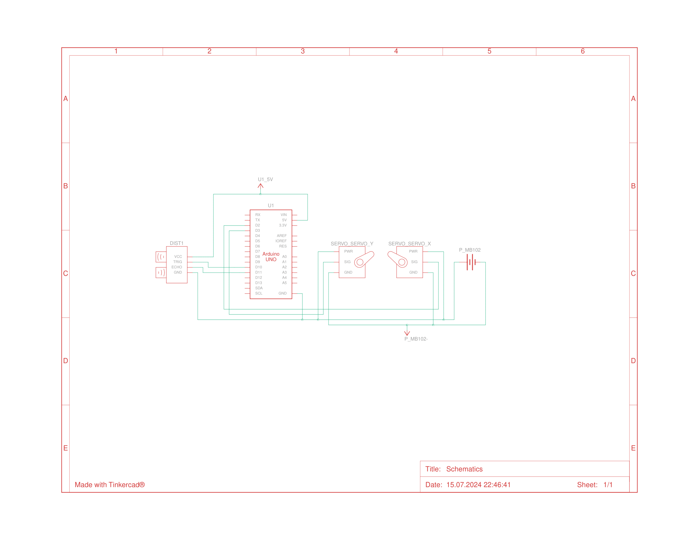

# Ultrasonic Sensor Point Cloud | Arduino
 Scanning the environment with an ultrasonic sensor to gather points that form a cloud which can be visualized in 3D using Arduino.

https://gwenyth06.github.io/Ultrasonic-Sensor-Point-Cloud-Arduino/3d_plot.html

# Components
1x HC-SR04 Ultrasonic Sensor
2x 9g Servos
1x 3.3V / 5V Output Breadboard Power Module 
1x 9V / 1 Amp Adaptor
1x Big Breadboard

# Tools and Machines
Male/Female Jumper Wires
Craft Sticks (You can use any material to build it.)
Glue Gun (Or any sort of adhesive that won't damage the components.)

# IDEs
I used Arduino IDE and Visual Studio Code for this project. You can use anything as you please.

# Description
This project aims to visualize real-time data from an ultrasonic sensor mounted on servo motors using 3D point cloud visualization. The ultrasonic sensor scans its environment by rotating on two axes, capturing distance measurements at various angles. These measurements are then converted into Cartesian coordinates and visualized as a dynamic 3D point cloud, providing an intuitive representation of the surrounding objects' spatial distribution and distances.

# Circuit Diagram
2 Servos powered by breadboard power supply and 1 Ultrasonic sensor powered by Arduino UNO itself. Servos shouldn't be powered by Arduino for the reason of not enough Amps being supplied and there is a possiblity to burn the voltage regulator. 9g Servos draw 500 mA to 750 mA and operate at 4.8 to 6 Volts so it is a way safer approach to use an external power supply. HC-SR04 ultrasonic module consumes 15 mA and operates at 5V so I connected it directly to Arduino.  

# Assembling the Components

